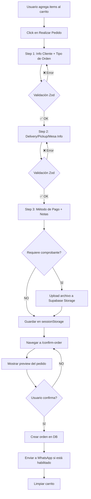

# Arquitectura del Sistema PideAI

**Versión:** 1.0
**Última actualización:** Noviembre 2025
**Stack:** React + TypeScript + Vite + Supabase

---

## Tabla de Contenidos

1. [Visión General](#visión-general)
2. [Arquitectura de Alto Nivel](#arquitectura-de-alto-nivel)
3. [Multi-tenancy](#multi-tenancy)
4. [Modelo de Datos](#modelo-de-datos)
5. [Gestión de Estado](#gestión-de-estado)
6. [Flujos Principales](#flujos-principales)
7. [Seguridad](#seguridad)
8. [Performance](#performance)
9. [Patrones y Convenciones](#patrones-y-convenciones)

---

## Visión General

PideAI es una plataforma SaaS multi-tenant para restaurantes que permite:

- Crear catálogos de productos con categorías y extras
- Recibir pedidos en tres modalidades: delivery, pickup, y servicio en tienda
- Gestionar horarios de operación y forzar estados (abierto/cerrado)
- Integración con WhatsApp para envío de pedidos
- Panel administrativo completo para gestión de menú, órdenes y configuración

### Características Clave

- ✅ Multi-tenant con subdominios
- ✅ Real-time notifications (Supabase Realtime)
- ✅ File uploads (comprobantes de pago)
- ✅ Sistema de templates para mensajes de WhatsApp
- ✅ Múltiples métodos de pago configurables
- ✅ Zonas de delivery con precios diferenciados
- ✅ Sistema de extras/modificadores para productos

---

## Arquitectura de Alto Nivel

```
┌─────────────────────────────────────────────────────────┐
│                    Frontend (React)                      │
│  ┌──────────────┐  ┌──────────────┐  ┌──────────────┐  │
│  │   Catalog    │  │    Admin     │  │     Auth     │  │
│  │   (Public)   │  │   (Private)  │  │              │  │
│  └──────────────┘  └──────────────┘  └──────────────┘  │
│                                                          │
│  ┌────────────────────────────────────────────────────┐ │
│  │              React Context Layer                    │ │
│  │  ┌────────────┐  ┌─────────────┐  ┌─────────────┐ │ │
│  │  │StoreContext│  │CartContext  │  │QueryClient  │ │ │
│  │  └────────────┘  └─────────────┘  └─────────────┘ │ │
│  └────────────────────────────────────────────────────┘ │
└─────────────────────────────────────────────────────────┘
                            │
                            │ Supabase SDK
                            ▼
┌─────────────────────────────────────────────────────────┐
│                   Supabase Backend                       │
│  ┌──────────────┐  ┌──────────────┐  ┌──────────────┐  │
│  │  PostgreSQL  │  │     Auth     │  │   Storage    │  │
│  │   Database   │  │              │  │              │  │
│  └──────────────┘  └──────────────┘  └──────────────┘  │
│  ┌──────────────┐  ┌──────────────┐                    │
│  │   Realtime   │  │   Row Level  │                    │
│  │  Subscript.  │  │   Security   │                    │
│  └──────────────┘  └──────────────┘                    │
└─────────────────────────────────────────────────────────┘
```

### Stack Tecnológico

**Frontend:**
- React 18.3 + TypeScript 5.8
- Vite 5.4 (Build tool)
- React Router 6.30 (Routing)
- TanStack Query 5.83 (Server state)
- React Hook Form 7.61 + Zod 3.25 (Forms & validation)
- shadcn/ui + Radix UI (UI components)
- Tailwind CSS 3.4 (Styling)

**Backend:**
- Supabase (BaaS)
  - PostgreSQL (Database)
  - Auth (Authentication)
  - Storage (File uploads)
  - Realtime (WebSocket subscriptions)

---

## Multi-tenancy

### Estrategia de Subdominios

El sistema utiliza subdominios para identificar tiendas:

```
producción:  tienda1.pideai.com → tienda "tienda1"
desarrollo:  localhost:8080 → localStorage.getItem("dev_subdomain")
```

#### Implementación (StoreContext)

```typescript
// src/contexts/StoreContext.tsx

const loadStore = async () => {
  const hostname = window.location.hostname;
  const parts = hostname.split(".");

  // Development: usar subdomain de localStorage
  let subdomain = localStorage.getItem("dev_subdomain") || "totus";

  // Production: extraer de hostname
  if (hostname.includes("pideai.com") && parts.length >= 3) {
    subdomain = parts[0];
  }

  // Fetch store data
  const { data } = await supabase
    .from("stores")
    .select("*")
    .eq("subdomain", subdomain)
    .eq("is_active", true)
    .single();
}
```

#### Aislamiento de Datos

- Cada query a la base de datos filtra por `store_id`
- Row Level Security (RLS) en Supabase asegura aislamiento
- El contexto `StoreContext` provee el store actual a toda la app

---

## Modelo de Datos

### Entidades Principales

```
stores (1) ──── (N) categories
                     │
                     └─ (N) menu_items
                              │
                              ├─ (N) product_extras
                              └─ (N) order_items

stores (1) ──── (N) orders
                     │
                     └─ (N) order_items
                              │
                              └─ (N) order_item_extras

stores (1) ──── (N) delivery_zones
stores (1) ──── (N) payment_methods
stores (1) ──── (N) store_hours
```

### Tabla: stores

Almacena configuración de cada tienda:

```typescript
interface Store {
  id: string;
  subdomain: string;              // Identificador único
  name: string;
  owner_id: string;               // FK a auth.users

  // Configuración operativa
  operating_modes: ("delivery" | "pickup" | "digital_menu")[];
  force_status: "normal" | "force_open" | "force_closed";

  // Configuración de pedidos
  minimum_order_price: number;
  redirect_to_whatsapp: boolean;
  require_payment_proof: boolean;

  // Templates de mensajes
  order_product_template: string;
  order_message_template_delivery: string;
  order_message_template_pickup: string;
  order_message_template_digital_menu: string;

  // Configuración UI
  currency: string;
  decimal_places: number;
  decimal_separator: string;
  thousands_separator: string;

  // Notificaciones
  enable_audio_notifications: boolean;
  notification_volume: number;
  notification_repeat_count: number;
}
```

### Tabla: orders

```typescript
interface Order {
  id: string;
  store_id: string;
  order_type: "delivery" | "pickup" | "digital_menu";
  status: "pending" | "confirmed" | "preparing" | "ready" | "delivered" | "cancelled";

  // Cliente
  customer_name: string;
  customer_email: string;
  customer_phone: string;

  // Delivery info
  delivery_address?: string;
  address_number?: string;
  address_complement?: string;
  address_neighborhood?: string;
  address_zipcode?: string;

  // Mesa (digital menu)
  table_number?: string;

  // Pago
  payment_method?: string;
  payment_proof_url?: string;
  total_amount: number;

  // Metadata
  notes?: string;
  created_at: string;
  updated_at: string;
}
```

### Relaciones Importantes

**Productos con Extras:**
```
menu_items ─┬─ (N) product_extras_items
            └─ vincula a product_extras
```

**Items en Pedido con Extras:**
```
order_items ─┬─ (N) order_item_extras
             └─ guarda snapshot del extra al momento del pedido
```

---

## Gestión de Estado

### Arquitectura de Estado

```
┌─────────────────────────────────────────┐
│         Global State (Context)          │
│  ┌─────────────┐    ┌────────────────┐ │
│  │StoreContext │    │ CartContext    │ │
│  │  - store    │    │  - items       │ │
│  │  - loading  │    │  - totalPrice  │ │
│  │  - isOwner  │    │  - actions     │ │
│  └─────────────┘    └────────────────┘ │
└─────────────────────────────────────────┘

┌─────────────────────────────────────────┐
│      Server State (React Query)         │
│  - Productos                             │
│  - Categorías                            │
│  - Órdenes                               │
│  - Configuración                         │
└─────────────────────────────────────────┘

┌─────────────────────────────────────────┐
│      Local State (useState)             │
│  - UI states (modals, forms)            │
│  - Filtros temporales                   │
└─────────────────────────────────────────┘

┌─────────────────────────────────────────┐
│      Persistent State                   │
│  - localStorage: carrito                │
│  - sessionStorage: pending order        │
└─────────────────────────────────────────┘
```

### StoreContext

**Responsabilidades:**
- Cargar datos de la tienda actual basado en subdomain
- Verificar si usuario actual es dueño de la tienda
- Proveer información global de la tienda

**Ubicación:** `src/contexts/StoreContext.tsx`

```typescript
const { store, loading, isStoreOwner } = useStore();
```

### CartContext

**Responsabilidades:**
- Gestionar items del carrito
- Calcular totales (considerando extras)
- Persistir en localStorage
- Manejar items con mismos productos pero diferentes extras

**Ubicación:** `src/contexts/CartContext.tsx`

**Key Feature: Unique Cart Items**
```typescript
// Items con mismo producto pero diferentes extras son tratados separadamente
const cartItemId = `${item.id}-${JSON.stringify(item.extras || [])}`;
```

### React Query

**Configuración:** `src/App.tsx`

**Uso típico:**
```typescript
const { data: products } = useQuery({
  queryKey: ["menu-items", store?.id],
  queryFn: async () => {
    const { data } = await supabase
      .from("menu_items")
      .select("*")
      .eq("store_id", store.id);
    return data;
  },
  enabled: !!store?.id,  // Solo ejecutar cuando hay store
});
```

---

## Flujos Principales

### 1. Flow: Carga Inicial de Tienda

```
Usuario accede → tienda1.pideai.com
                       ↓
         StoreContext extrae subdomain
                       ↓
         Query a Supabase: stores WHERE subdomain='tienda1'
                       ↓
         ¿Tienda existe y activa?
          ├─ SÍ → Cargar catálogo
          └─ NO → Mostrar "Tienda no encontrada"
```

### 2. Flow: Realizar Pedido (Checkout)



**Archivos involucrados:**
- `src/pages/Checkout.tsx` - Multi-step form
- `src/pages/ConfirmOrder.tsx` - Preview y confirmación
- `src/lib/whatsappMessageGenerator.ts` - Generación de mensajes

### 3. Flow: Notificaciones en Tiempo Real

```
Nueva orden creada en DB
         ↓
Supabase Realtime trigger
         ↓
useOrderNotifications hook (solo para store owners)
         ↓
Toast notification + Audio alert
         ↓
Admin puede ver nueva orden inmediatamente
```

**Implementación:**
```typescript
// src/hooks/useOrderNotifications.ts

const channel = supabase
  .channel('order-notifications')
  .on('postgres_changes', {
    event: 'INSERT',
    schema: 'public',
    table: 'orders',
    filter: `store_id=eq.${store.id}`
  }, (payload) => {
    toast.success('¡Nueva orden recibida!');
    playNotificationSound(volume, repeatCount);
  })
  .subscribe();
```

### 4. Flow: Cálculo de Estado de Tienda (Abierto/Cerrado)

```typescript
// src/hooks/useStoreStatus.ts

// Prioridad de estado:
1. force_status === "force_open" → Siempre abierto
2. force_status === "force_closed" → Siempre cerrado
3. force_status === "normal" → Verificar horarios

// Verificación de horarios:
- Obtener día actual (0-6)
- Obtener hora actual (HH:mm)
- Buscar en store_hours si hay match
- Calcular próxima hora de apertura si está cerrado
```

---

## Seguridad

### Autenticación

- **Proveedor:** Supabase Auth
- **Método:** Email + Password
- **Flow:** Magic links disponibles pero no implementados

```typescript
// Login
await supabase.auth.signInWithPassword({
  email: email,
  password: password,
});

// Signup
await supabase.auth.signUp({
  email: email,
  password: password,
  options: {
    data: { full_name: name }
  }
});
```

### Autorización

**Verificación de Store Owner:**
```typescript
const { store, isStoreOwner } = useStore();

// En StoreContext:
const { data: { session } } = await supabase.auth.getSession();
setIsStoreOwner(session?.user?.id === data.owner_id);
```

### Row Level Security (RLS)

Supabase RLS policies deben estar configuradas para:

1. **stores:** Solo el owner puede editar su tienda
2. **orders:** Solo el store owner puede ver órdenes de su tienda
3. **menu_items:** Lectura pública, escritura solo para owner
4. **categories:** Lectura pública, escritura solo para owner

### Validación de Datos

**Frontend (Zod):**
```typescript
const schema = z.object({
  customer_name: z.string()
    .trim()
    .min(2, "Mínimo 2 caracteres")
    .max(100, "Máximo 100 caracteres"),
  customer_email: z.string()
    .trim()
    .email("Email inválido")
});
```

**⚠️ IMPORTANTE:** Validación solo en frontend. Se recomienda agregar validación en backend usando Supabase Functions o Database triggers.

### File Uploads

```typescript
// Checkout.tsx
const { data: uploadData } = await supabase.storage
  .from('payment-proofs')
  .upload(fileName, paymentProofFile);
```

**Validaciones implementadas:**
- Tamaño máximo: 5MB
- Tipos permitidos: JPG, PNG, WEBP, PDF
- ⚠️ Solo validación en cliente

---

## Performance

### Optimizaciones Implementadas

1. **React Query Caching**
```typescript
queryKey: ["products", store?.id]  // Auto-cache y deduplication
```

2. **Conditional Fetching**
```typescript
enabled: !!store?.id  // No fetch hasta tener store
```

3. **Lazy Loading de Imágenes**
```typescript

```

4. **Code Splitting (Routes)**
```typescript
// Automático con React Router + Vite
```

### Oportunidades de Mejora

1. **React.memo** en componentes pesados
   - `ProductCard`
   - `OrderCard`
   - `MenuItemsManager`

2. **useMemo/useCallback** para cálculos costosos
```typescript
const totalPrice = useMemo(() =>
  items.reduce((sum, item) => sum + item.price * item.quantity, 0),
  [items]
);
```

3. **Virtualization** para listas largas
   - Lista de productos (si > 100 items)
   - Lista de órdenes

4. **Pagination en queries**
```typescript
.range(0, 49)  // Solo primeros 50 registros
```

---

## Patrones y Convenciones

### Estructura de Componentes

```typescript
// Pattern: Component con props tipadas
interface ProductCardProps {
  id: string;
  name: string;
  price: number;
  image_url: string | null;
}

export const ProductCard = ({ id, name, price, image_url }: ProductCardProps) => {
  // Hooks primero
  const { addItem } = useCart();
  const navigate = useNavigate();
  const [state, setState] = useState();

  // Event handlers
  const handleClick = () => { /* ... */ };

  // Render
  return <div>...</div>;
};
```

### Custom Hooks

**Naming:** Prefijo `use` + nombre descriptivo

```typescript
// src/hooks/useStoreStatus.ts
export function useStoreStatus(storeId, forceStatus) {
  const [status, setStatus] = useState();

  useEffect(() => {
    loadStoreHours();
  }, [storeId]);

  return { status, loading };
}
```

### Manejo de Errores

**Pattern:**
```typescript
try {
  const { data, error } = await supabase.from('table').select();

  if (error) throw error;

  // Success handling
  setData(data);
} catch (error) {
  console.error("Context:", error);
  toast.error("User-friendly message");
} finally {
  setLoading(false);
}
```

### Naming Conventions

```typescript
// Components: PascalCase
ProductCard, AdminDashboard

// Files: PascalCase (components), camelCase (utils)
ProductCard.tsx, whatsappMessageGenerator.ts

// Hooks: camelCase con prefijo 'use'
useCart, useStoreStatus

// Constants: UPPER_SNAKE_CASE
const MAX_FILE_SIZE = 5 * 1024 * 1024;

// Props interfaces: ComponentNameProps
interface ProductCardProps { }
```

### Folder Structure

```
src/
├── components/
│   ├── catalog/        # Componentes públicos (catálogo)
│   ├── admin/          # Componentes de administración
│   ├── cart/           # Componentes del carrito
│   └── ui/             # shadcn/ui components
├── pages/              # Componentes de página (routes)
│   └── admin/          # Páginas de admin
├── contexts/           # React Context providers
├── hooks/              # Custom hooks
├── lib/                # Utilidades y helpers
├── integrations/       # Integraciones externas (Supabase)
└── assets/             # Imágenes, fonts, etc
```

---

## Diagramas de Arquitectura

### Flujo de Datos

```
┌──────────┐
│  Usuario │
└────┬─────┘
     │ interact
     ▼
┌──────────────────┐
│  React Component │
│  (src/pages)     │
└────┬─────────────┘
     │ use
     ▼
┌──────────────────┐      ┌──────────────────┐
│  Context/Hooks   │◄─────│  React Query     │
│  (state)         │      │  (server cache)  │
└────┬─────────────┘      └────┬─────────────┘
     │                          │
     │ call                     │ fetch
     ▼                          ▼
┌───────────────────────────────────────┐
│         Supabase SDK                  │
│  ┌────────┐  ┌────────┐  ┌─────────┐ │
│  │  Auth  │  │   DB   │  │ Storage │ │
│  └────────┘  └────────┘  └─────────┘ │
└───────────────────────────────────────┘
```

### Ciclo de Vida de un Pedido

```
[pending] ──→ [confirmed] ──→ [preparing] ──→ [ready] ──→ [delivered]
    │                                                          │
    └──────────────────── [cancelled] ←───────────────────────┘
```

---

## Configuración del Proyecto

### Variables de Entorno

```bash
# .env
VITE_SUPABASE_URL=https://xxx.supabase.co
VITE_SUPABASE_PUBLISHABLE_KEY=eyJ...
```

### Scripts

```json
{
  "dev": "vite",                    // Desarrollo en :8080
  "build": "vite build",            // Build producción
  "build:dev": "vite build --mode development",
  "lint": "eslint .",
  "preview": "vite preview"
}
```

### Path Aliases

```typescript
// tsconfig.json
{
  "paths": {
    "@/*": ["./src/*"]
  }
}

// Uso:
import { Button } from "@/components/ui/button"
```

---

## Deployment

### Producción

1. **Frontend:** Cualquier hosting estático (Vercel, Netlify, Cloudflare Pages)
2. **Backend:** Supabase (managed)
3. **DNS:** Configurar wildcard subdomain `*.pideai.com`

### Configuración DNS

```
A     @               → Sitio principal
CNAME *               → Frontend hosting
CNAME *.pideai.com    → Frontend hosting (wildcard)
```

---

## Métricas y Monitoreo

### Recomendaciones

**Error Tracking:**
- Sentry para errores frontend
- Supabase logs para errores backend

**Analytics:**
- Google Analytics para uso general
- Mixpanel/Amplitude para eventos específicos

**Performance:**
- Lighthouse CI en pipeline
- Web Vitals tracking

---

## Glosario

- **Store:** Tienda/restaurante individual en el sistema
- **Subdomain:** Identificador único de la tienda (ej: `tienda1`)
- **Operating Mode:** Modalidad de operación (delivery/pickup/digital_menu)
- **Force Status:** Override manual del estado de la tienda
- **Cart Item ID:** Identificador único de item en carrito (producto + extras)
- **Store Owner:** Usuario dueño de la tienda con permisos admin

---

## Referencias

- [React Query Docs](https://tanstack.com/query/latest)
- [Supabase Docs](https://supabase.com/docs)
- [shadcn/ui](https://ui.shadcn.com/)
- [React Hook Form + Zod](https://react-hook-form.com/get-started#SchemaValidation)

---

**Mantenido por:** Equipo de Desarrollo PideAI
**Contacto:** [Agregar contacto]
